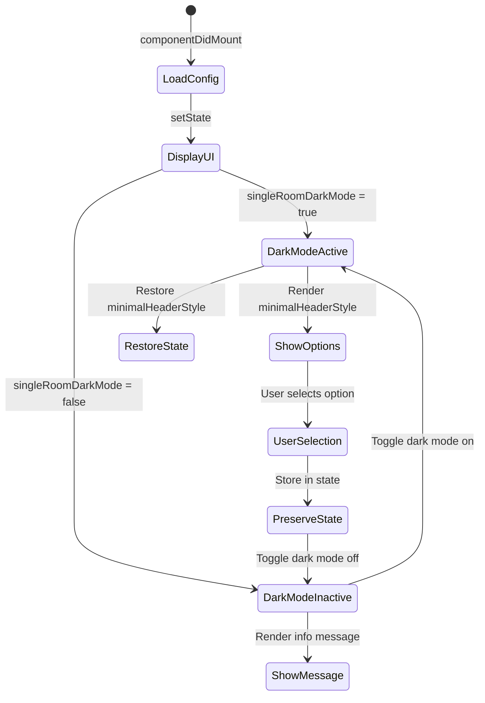
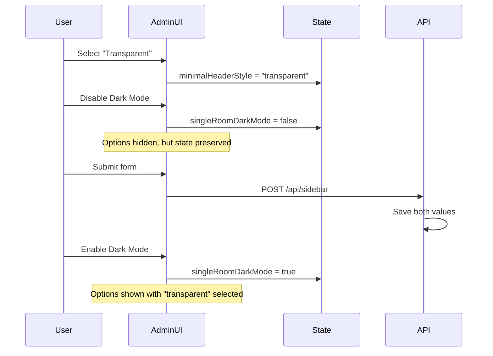

# Design Document: Admin Panel Dark-Mode Konfiguration

## Overview

Dieses Feature implementiert die kontextabhängige Anzeige von Dark-Mode-spezifischen Konfigurationsoptionen im Admin Panel. Die Optionen "Gefüllt" und "Transparent" für die Raum-Minimal-Konfiguration werden nur angezeigt, wenn der Dark-Mode aktiv ist, wodurch die Benutzeroberfläche übersichtlicher wird und irrelevante Optionen ausgeblendet werden.

Die Implementierung erfolgt durch Erweiterung der bestehenden Admin-Komponente (`ui-react/src/components/admin/Admin.js`), die bereits die Sidebar-Konfiguration verwaltet. Die Lösung nutzt React's State-Management und bedingte Rendering-Mechanismen, um die UI-Optionen dynamisch basierend auf dem `singleRoomDarkMode`-Status anzuzeigen.

## Architecture

### Component Structure

Die Implementierung erfolgt innerhalb der bestehenden `Admin` Klassen-Komponente:

```
Admin Component (ui-react/src/components/admin/Admin.js)
├── State Management
│   ├── singleRoomDarkMode (boolean)
│   ├── minimalHeaderStyle (string: 'filled' | 'transparent')
│   └── currentSingleRoomDarkMode (boolean)
├── Render Logic
│   ├── Sidebar Configuration Section
│   │   ├── Dark Mode Checkbox
│   │   ├── Conditional: minimalHeaderStyle Options
│   │   └── Conditional: Informational Message
│   └── Current Configuration Display
└── Event Handlers
    └── handleSidebarSubmit()
```

### State Flow



### Integration Points

1. **State Management**: Nutzt bestehende React Component State
2. **API Integration**: Verwendet bestehenden `/api/sidebar` Endpoint
3. **Configuration Persistence**: Speichert Werte in `data/sidebar-config.json`
4. **Real-time Updates**: Nutzt bestehende Socket.io Integration für Live-Updates

## Components and Interfaces

### Modified Component: Admin.js

#### State Properties

```javascript
// Existing state properties to be used
{
  singleRoomDarkMode: boolean,           // Current dark mode toggle state
  minimalHeaderStyle: string,            // 'filled' or 'transparent'
  currentSingleRoomDarkMode: boolean,    // Saved dark mode state from server
  currentMinimalHeaderStyle: string      // Saved style from server
}
```

#### Conditional Rendering Logic

```javascript
// Pseudo-code for conditional rendering
render() {
  const { singleRoomDarkMode, minimalHeaderStyle } = this.state;
  
  return (
    <div className="admin-form-group">
      {/* Dark Mode Checkbox - always visible */}
      <DarkModeCheckbox />
      
      {/* Conditional: Show options only when dark mode is active */}
      {singleRoomDarkMode && (
        <MinimalHeaderStyleOptions 
          value={minimalHeaderStyle}
          onChange={this.handleStyleChange}
        />
      )}
      
      {/* Conditional: Show message when dark mode is inactive */}
      {!singleRoomDarkMode && (
        <InformationalMessage />
      )}
    </div>
  );
}
```

### UI Components Structure

#### 1. Dark Mode Checkbox (Existing)
- **Location**: Sidebar configuration section
- **Behavior**: Toggles `singleRoomDarkMode` state
- **Always visible**: Yes

#### 2. Minimal Header Style Options (Modified)
- **Location**: Below dark mode checkbox
- **Visibility**: Conditional on `singleRoomDarkMode === true`
- **Options**:
  - Radio button: "Gefüllt (Farbiger Hintergrund)"
  - Radio button: "Transparent (Nur Rahmen)"
- **State binding**: `minimalHeaderStyle`

#### 3. Informational Message (New)
- **Location**: Below dark mode checkbox
- **Visibility**: Conditional on `singleRoomDarkMode === false`
- **Content**: "Diese Optionen sind nur im Dark-Mode verfügbar."
- **Styling**: Subtle info message (gray text, small font)

### Translation Keys

Neue Übersetzungsschlüssel in `ui-react/src/config/adminTranslations.js`:

```javascript
{
  de: {
    minimalHeaderStyleDarkModeRequired: "Diese Optionen sind nur im Dark-Mode verfügbar."
  },
  en: {
    minimalHeaderStyleDarkModeRequired: "These options are only available in Dark Mode."
  }
}
```

## Data Models

### Sidebar Configuration Schema

Die bestehende Konfiguration in `data/sidebar-config.json` bleibt unverändert:

```json
{
  "showWiFi": boolean,
  "showUpcomingMeetings": boolean,
  "showMeetingTitles": boolean,
  "upcomingMeetingsCount": number,
  "minimalHeaderStyle": "filled" | "transparent",
  "singleRoomDarkMode": boolean,
  "lastUpdated": string (ISO 8601)
}
```

**Wichtig**: Der Wert von `minimalHeaderStyle` wird immer gespeichert, unabhängig vom Dark-Mode-Status. Dies ermöglicht die Wiederherstellung der Einstellung, wenn Dark-Mode wieder aktiviert wird.

### State Persistence Behavior



## Correctness Properties

*A property is a characteristic or behavior that should hold true across all valid executions of a system-essentially, a formal statement about what the system should do. Properties serve as the bridge between human-readable specifications and machine-verifiable correctness guarantees.*

### Property 1: Dark Mode Options Visibility

*For any* Admin Panel state where `singleRoomDarkMode` is `true`, both the Filled option and Transparent option radio buttons SHALL be rendered in the DOM.

**Validates: Requirements 1.1, 1.2**

### Property 2: Dark Mode Options Hidden

*For any* Admin Panel state where `singleRoomDarkMode` is `false`, neither the Filled option nor the Transparent option radio buttons SHALL be rendered in the DOM.

**Validates: Requirements 1.3, 1.4**

### Property 3: Dark Mode Status Detection

*For any* valid sidebar configuration loaded from the server, the Admin Panel SHALL correctly set the `singleRoomDarkMode` state to match the configuration value.

**Validates: Requirements 2.1**

### Property 4: Configuration Persistence Through Toggle

*For any* `minimalHeaderStyle` value ('filled' or 'transparent'), if dark mode is toggled off and then back on without form submission, the `minimalHeaderStyle` state SHALL remain unchanged.

**Validates: Requirements 3.1, 3.2**

### Property 5: Informational Message Display

*For any* Admin Panel state where `singleRoomDarkMode` is `false`, an informational message SHALL be displayed indicating that the options require Dark Mode to be active.

**Validates: Requirements 4.1**

### Property 6: Message Length Constraint

*For any* language translation of the informational message, the text length SHALL be less than or equal to 100 characters.

**Validates: Requirements 4.2**

## Error Handling

### Validation

1. **State Validation**: 
   - `minimalHeaderStyle` muss entweder 'filled' oder 'transparent' sein
   - `singleRoomDarkMode` muss ein boolean sein
   - Fallback auf Standardwerte bei ungültigen Daten

2. **API Error Handling**:
   - Bestehende Error-Handling-Mechanismen werden wiederverwendet
   - Bei Fehlern wird die vorherige Konfiguration beibehalten
   - Fehlermeldungen werden dem Benutzer angezeigt

### Edge Cases

1. **Konfiguration existiert nicht**: Standardwerte verwenden
   - `singleRoomDarkMode`: `false`
   - `minimalHeaderStyle`: `'filled'`

2. **Gleichzeitige Änderungen**: 
   - Socket.io Updates überschreiben lokale Änderungen
   - Benutzer wird über Änderungen informiert

3. **Browser-Kompatibilität**:
   - Conditional Rendering funktioniert in allen modernen Browsern
   - Keine speziellen Polyfills erforderlich

## Testing Strategy

### Unit Testing (Vitest + React Testing Library)

Die Tests werden in `ui-react/src/components/admin/Admin.test.js` hinzugefügt.

**Test Categories**:

1. **Conditional Rendering Tests**:
   - Optionen werden angezeigt wenn Dark Mode aktiv ist
   - Optionen werden ausgeblendet wenn Dark Mode inaktiv ist
   - Informationsnachricht wird angezeigt wenn Dark Mode inaktiv ist
   - Informationsnachricht wird ausgeblendet wenn Dark Mode aktiv ist

2. **State Persistence Tests**:
   - minimalHeaderStyle bleibt erhalten beim Umschalten von Dark Mode
   - Werte werden korrekt vom Server geladen
   - Werte werden korrekt an den Server gesendet

3. **User Interaction Tests**:
   - Dark Mode Checkbox Toggle funktioniert
   - Radio Button Selection funktioniert (wenn sichtbar)
   - Form Submission sendet korrekte Daten

4. **Edge Case Tests**:
   - Ungültige Konfigurationswerte werden behandelt
   - Fehlende Konfiguration verwendet Standardwerte
   - Nachrichtenlänge überschreitet nicht 100 Zeichen

### Property-Based Testing (fast-check)

Property-based Tests werden mit der `fast-check` Library implementiert (muss zu `devDependencies` hinzugefügt werden).

**Configuration**: Jeder Property-Test läuft mit mindestens 100 Iterationen.

**Property Test 1: Dark Mode Options Visibility**
```javascript
// Feature: admin-dark-mode-options, Property 1: Dark Mode Options Visibility
fc.assert(
  fc.property(
    fc.record({
      singleRoomDarkMode: fc.constant(true),
      minimalHeaderStyle: fc.constantFrom('filled', 'transparent')
    }),
    (state) => {
      const { container } = render(<Admin initialState={state} />);
      const filledOption = container.querySelector('input[value="filled"]');
      const transparentOption = container.querySelector('input[value="transparent"]');
      return filledOption !== null && transparentOption !== null;
    }
  ),
  { numRuns: 100 }
);
```

**Property Test 2: Dark Mode Options Hidden**
```javascript
// Feature: admin-dark-mode-options, Property 2: Dark Mode Options Hidden
fc.assert(
  fc.property(
    fc.record({
      singleRoomDarkMode: fc.constant(false),
      minimalHeaderStyle: fc.constantFrom('filled', 'transparent')
    }),
    (state) => {
      const { container } = render(<Admin initialState={state} />);
      const filledOption = container.querySelector('input[value="filled"]');
      const transparentOption = container.querySelector('input[value="transparent"]');
      return filledOption === null && transparentOption === null;
    }
  ),
  { numRuns: 100 }
);
```

**Property Test 3: Dark Mode Status Detection**
```javascript
// Feature: admin-dark-mode-options, Property 3: Dark Mode Status Detection
fc.assert(
  fc.property(
    fc.boolean(),
    (darkModeValue) => {
      const mockConfig = { singleRoomDarkMode: darkModeValue };
      const admin = new Admin({});
      admin.setState({ ...mockConfig });
      return admin.state.singleRoomDarkMode === darkModeValue;
    }
  ),
  { numRuns: 100 }
);
```

**Property Test 4: Configuration Persistence Through Toggle**
```javascript
// Feature: admin-dark-mode-options, Property 4: Configuration Persistence Through Toggle
fc.assert(
  fc.property(
    fc.constantFrom('filled', 'transparent'),
    (initialStyle) => {
      const { rerender } = render(
        <Admin initialState={{ 
          singleRoomDarkMode: true, 
          minimalHeaderStyle: initialStyle 
        }} />
      );
      
      // Toggle dark mode off
      rerender(
        <Admin initialState={{ 
          singleRoomDarkMode: false, 
          minimalHeaderStyle: initialStyle 
        }} />
      );
      
      // Toggle dark mode back on
      const { container } = rerender(
        <Admin initialState={{ 
          singleRoomDarkMode: true, 
          minimalHeaderStyle: initialStyle 
        }} />
      );
      
      const selectedOption = container.querySelector(`input[value="${initialStyle}"]`);
      return selectedOption && selectedOption.checked;
    }
  ),
  { numRuns: 100 }
);
```

**Property Test 5: Informational Message Display**
```javascript
// Feature: admin-dark-mode-options, Property 5: Informational Message Display
fc.assert(
  fc.property(
    fc.record({
      singleRoomDarkMode: fc.constant(false),
      minimalHeaderStyle: fc.constantFrom('filled', 'transparent')
    }),
    (state) => {
      const { container } = render(<Admin initialState={state} />);
      const message = container.textContent;
      return message.includes('Dark-Mode') || message.includes('Dark Mode');
    }
  ),
  { numRuns: 100 }
);
```

**Property Test 6: Message Length Constraint**
```javascript
// Feature: admin-dark-mode-options, Property 6: Message Length Constraint
fc.assert(
  fc.property(
    fc.constantFrom('de', 'en'),
    (language) => {
      const translations = getAdminTranslations(language);
      const message = translations.minimalHeaderStyleDarkModeRequired;
      return message.length <= 100;
    }
  ),
  { numRuns: 100 }
);
```

### Integration Testing

**Cypress E2E Tests** (optional, für vollständige Abdeckung):

1. Test: Benutzer aktiviert Dark Mode und sieht Optionen
2. Test: Benutzer deaktiviert Dark Mode und sieht Informationsnachricht
3. Test: Benutzer wählt Option, deaktiviert Dark Mode, aktiviert wieder und sieht gespeicherte Auswahl
4. Test: Konfiguration wird über Socket.io Updates aktualisiert

### Test Coverage Goals

- **Unit Tests**: 100% Code Coverage für neue/geänderte Zeilen
- **Property Tests**: Alle 6 Correctness Properties abgedeckt
- **Integration Tests**: Kritische User Journeys abgedeckt
