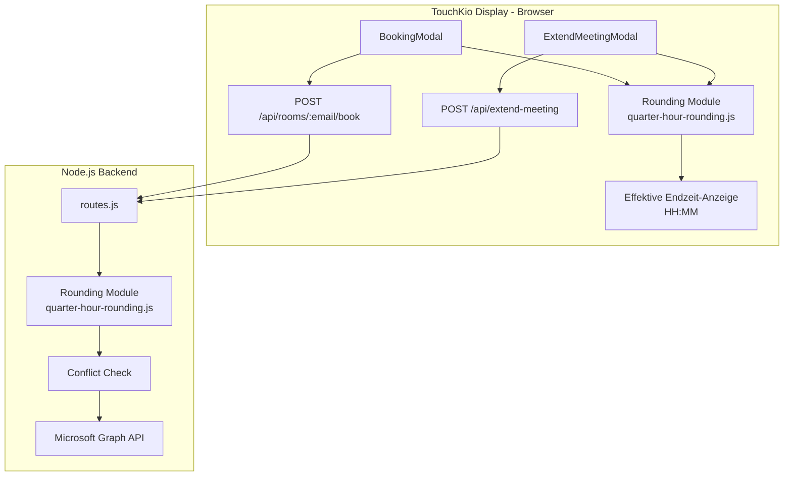

# Design Document: Booking Quarter-Hour Rounding

## Overview

Dieses Feature implementiert das automatische Aufrunden von Buchungs-Endzeiten auf die nächste Viertelstundengrenze (xx:00, xx:15, xx:30, xx:45). Die Rundungslogik wird als ein zentrales, deterministisches Modul realisiert, das sowohl client-seitig (für die Vorschau im UI) als auch server-seitig (für die Validierung und Graph-API-Aufrufe) eingesetzt wird.

**Designentscheidungen:**
- Die Rundungsfunktion wird als reine Funktion (pure function) ohne Seiteneffekte implementiert, um Testbarkeit und Wiederverwendbarkeit zu maximieren.
- Sowohl Client als auch Server führen die Rundung durch: Der Client für die sofortige Vorschau, der Server als autoritative Validierung (Defense in Depth).
- Die Rundungsfunktion wird in einer eigenen Datei (`quarter-hour-rounding.js`) gekapselt, die sowohl von Node.js als auch vom Browser-Build importiert werden kann.

## Architecture



**Architekturprinzip:** Der Client berechnet die gerundete Endzeit für die Vorschau. Der Server rundet erneut, bevor er Konflikte prüft und die Graph-API aufruft. So ist das System auch bei manipulierten Client-Anfragen konsistent.

## Components and Interfaces

### 1. Rounding Module (`quarter-hour-rounding.js`)

Gemeinsame Datei, die sowohl client-seitig als auch server-seitig verwendet wird.

```javascript
/**
 * Rounds a Date up to the next quarter-hour boundary.
 * If the time is already on a boundary (minutes ∈ {0,15,30,45}, seconds=0, ms=0),
 * returns the input unchanged.
 *
 * @param {Date} date - The input date/time
 * @returns {Date} A new Date rounded up to the next quarter-hour boundary
 */
export function roundUpToQuarterHour(date) { ... }

/**
 * Checks whether a Date is exactly on a quarter-hour boundary.
 *
 * @param {Date} date - The date to check
 * @returns {boolean} true if minutes ∈ {0,15,30,45} and seconds=0, ms=0
 */
export function isQuarterHourBoundary(date) { ... }
```

**Speicherort:**
- Client: `ui-react/src/utils/quarter-hour-rounding.js`
- Server: `app/quarter-hour-rounding.js` (identische Logik, CommonJS-Export)

Alternativ kann eine einzelne Datei in `app/quarter-hour-rounding.js` erstellt werden, die der Server direkt per `require` lädt, und die vom Vite-Build des Clients als Alias importiert wird. Entscheidung: Zwei separate Dateien mit identischer Logik, um den Build-Prozess nicht zu verkomplizieren. Die Property-Tests validieren, dass beide Implementierungen identisch arbeiten.

### 2. BookingModal Erweiterungen

Änderungen an `ui-react/src/components/booking/BookingModal.jsx`:

- Import von `roundUpToQuarterHour` aus dem Rounding Module
- Neuer State: `effectiveEndTime` (die gerundete Endzeit als Date)
- Neue Methode: `calculateEffectiveEndTime()` — berechnet `now + duration`, rundet auf, setzt `effectiveEndTime`
- Anzeige der effektiven Endzeit im Format HH:MM im Modal
- Timer (30-Sekunden-Intervall) zum Aktualisieren der Vorschau bei geöffnetem Modal
- Beim Submit: Die gerundete Endzeit wird als `endTime` an die API gesendet

### 3. ExtendMeetingModal Erweiterungen

Änderungen an `ui-react/src/components/booking/ExtendMeetingModal.jsx`:

- Import von `roundUpToQuarterHour`
- Neuer State: `effectiveNewEndTime`
- Neue Methode: `calculateEffectiveNewEndTime()` — berechnet `currentMeetingEnd + duration`, rundet auf
- Anzeige der effektiven neuen Endzeit
- Timer (30-Sekunden-Intervall) für Aktualisierung
- Konfliktprüfung gegen `room.Appointments` (nächstes Meeting)
- Beim Submit: Die gerundete Endzeit wird mit an die API gesendet

### 4. Server-seitige Rundung (routes.js)

Änderungen an `app/routes.js`:

- Import von `roundUpToQuarterHour` aus `app/quarter-hour-rounding.js`
- **POST /api/rooms/:roomEmail/book**: Nach Parsing von `endTime` wird `roundUpToQuarterHour` angewandt, bevor Konflikte geprüft und das Event erstellt wird. Die gerundete Endzeit wird in der Response als `effectiveEndTime` (ISO 8601) zurückgegeben.
- **POST /api/extend-meeting**: Nach Berechnung von `newEnd = currentEnd + minutes` wird `roundUpToQuarterHour` angewandt. Konflikte und End-of-Day-Prüfung verwenden die gerundete Zeit. Die Response enthält `effectiveEndTime`.

### 5. Booking Utils Erweiterung

Optionale Hilfsfunktion in `booking-utils.js`:

```javascript
/**
 * Formats a Date as HH:MM string (24h format).
 * @param {Date} date
 * @returns {string} z.B. "10:15"
 */
export function formatTimeHHMM(date) { ... }
```

## Data Models

### Rounding Module Input/Output

| Field | Type | Description |
|-------|------|-------------|
| input | `Date` | Beliebiger Zeitpunkt (JS Date Objekt) |
| output | `Date` | Neues Date-Objekt auf nächster Viertelstundengrenze |

### API Request (Booking) — Erweiterung

```json
{
  "subject": "Meeting",
  "startTime": "2024-01-15T10:03:00.000Z",
  "endTime": "2024-01-15T10:33:00.000Z",
  "roomGroup": "Floor 1"
}
```

Der Server rundet `endTime` zu `2024-01-15T10:45:00.000Z`.

### API Response (Booking) — Erweiterung

```json
{
  "success": true,
  "id": "event-id",
  "subject": "Meeting",
  "effectiveEndTime": "2024-01-15T10:45:00.000Z"
}
```

### API Response (Extend Meeting) — Erweiterung

```json
{
  "success": true,
  "message": "Meeting extended by 30 minutes",
  "newEndTime": "2024-01-15T11:00:00.000Z",
  "effectiveEndTime": "2024-01-15T11:00:00.000Z"
}
```

## Correctness Properties

*A property is a characteristic or behavior that should hold true across all valid executions of a system — essentially, a formal statement about what the system should do. Properties serve as the bridge between human-readable specifications and machine-verifiable correctness guarantees.*

### Property 1: Rounding always produces a quarter-hour boundary

*For any* Date object with hours 0–23, minutes 0–59, seconds 0–59, and milliseconds 0–999, applying `roundUpToQuarterHour` SHALL produce a Date whose minutes are in the set {0, 15, 30, 45} and whose seconds and milliseconds are both zero.

**Validates: Requirements 3.1, 1.1, 2.1, 4.1, 4.2**

### Property 2: Rounding is idempotent

*For any* Date object, applying `roundUpToQuarterHour` twice SHALL produce the same result as applying it once: `roundUpToQuarterHour(roundUpToQuarterHour(x)).getTime() === roundUpToQuarterHour(x).getTime()`.

**Validates: Requirements 3.4, 3.2, 1.2, 2.2, 4.4**

### Property 3: Rounding delta is bounded

*For any* Date object that is NOT already on a quarter-hour boundary (minutes not in {0,15,30,45} OR seconds > 0 OR milliseconds > 0), the difference between the rounded result and the original time SHALL be strictly greater than 0 and at most 14 minutes and 59 seconds (899 seconds).

**Validates: Requirements 3.3**

### Property 4: Hour and day rollover correctness

*For any* Date object where rounding would advance minutes past 59, the hour SHALL increment by one. *For any* Date at hour 23 where rounding would advance past 23:59, the date SHALL increment by one day and the time SHALL be set to 00:00.

**Validates: Requirements 3.5**

### Property 5: Conflict detection uses rounded end time

*For any* extension scenario where the unrounded new end time does NOT conflict with the next meeting, but the rounded new end time DOES exceed the next meeting's start time, the system SHALL detect and report the conflict.

**Validates: Requirements 2.6, 4.5**

## Error Handling

### Client-seitig

| Szenario | Verhalten |
|----------|-----------|
| Gerundete Endzeit konfligiert mit nächstem Meeting | Fehlermeldung im Modal, Submit wird verhindert |
| Kein aktives Meeting bei Verlängerung | Fehlermeldung "Kein aktives Meeting vorhanden" |
| Server antwortet mit Konflikt (HTTP 409) | Fehlermeldung "Zeitkonflikt mit anderem Termin" |
| Server antwortet mit End-of-Day-Fehler (HTTP 400) | Fehlermeldung "Meeting kann nicht über das Tagesende hinaus verlängert werden" |
| Netzwerkfehler | Retry-Mechanismus (bestehendes `fetchWithRetry`) + Fehlermeldung |

### Server-seitig

| Szenario | HTTP Status | Response |
|----------|-------------|----------|
| Gerundete Endzeit konfligiert mit nachfolgendem Event | 409 | `{ success: false, error: "Conflict" }` |
| Gerundete Endzeit überschreitet 23:59 | 400 | `{ success: false, error: "End of day exceeded" }` |
| Ungültige Endzeit (nicht parsbar) | 400 | `{ error: "Invalid end time" }` |
| Graph API Fehler | 500 | `{ error: "Booking failed" }` |

### Edge Cases

- **Zeitpunkt genau auf Grenze (z.B. 10:15:00.000):** Keine Rundung, Eingabe wird unverändert zurückgegeben.
- **23:46–23:59 Uhr:** Rundung auf 00:00 des nächsten Tages. Server prüft End-of-Day und lehnt ab.
- **Timer-Refresh während Submit:** Der Submit verwendet den zum Zeitpunkt des Klicks berechneten Wert, nicht den Timer-Wert.

## Testing Strategy

### Unit Tests (Vitest)

- `ui-react/src/utils/quarter-hour-rounding.test.js`: Beispiel-basierte Tests für die Client-seitige Rundungsfunktion (spezifische Uhrzeiten, Randfälle wie 23:59, 00:00)
- `app/__tests__/quarter-hour-rounding.test.js`: Beispiel-basierte Tests für die Server-seitige Rundungsfunktion
- `BookingModal.test.jsx`: Komponenten-Tests für die Endzeit-Vorschau-Anzeige, Timer-Refresh, Konfliktwarnung
- `ExtendMeetingModal.test.jsx`: Komponenten-Tests für die neue Endzeit-Vorschau, Validierung gegen nächstes Meeting

### Property-Based Tests (fast-check)

Die Property-Tests verwenden `fast-check` (bereits als Dependency installiert) und `node:test` als Runner.

- **Datei:** `app/__tests__/quarter-hour-rounding.property.test.js`
- **Konfiguration:** Minimum 100 Runs pro Property (`{ numRuns: 200 }`)
- **Tag-Format:** `Feature: booking-quarter-hour-rounding, Property {N}: {title}`

Jede Correctness Property (1–5) wird als eigenständiger Property-Based Test implementiert:

1. **Property 1:** Generator erzeugt zufällige Dates (beliebige h/m/s/ms). Assertion: Ergebnis hat minutes ∈ {0,15,30,45}, seconds=0, ms=0.
2. **Property 2:** Generator erzeugt zufällige Dates. Assertion: `round(round(x)) === round(x)`.
3. **Property 3:** Generator erzeugt Dates die NICHT auf Boundary liegen. Assertion: 0 < diff ≤ 899000ms.
4. **Property 4:** Generator erzeugt Dates mit minutes > 45. Assertion: Stunde/Tag werden korrekt inkrementiert.
5. **Property 5:** Generator erzeugt Szenarien (currentEnd, duration, nextMeetingStart) wo ungerundetes Ende < nextStart aber gerundetes Ende ≥ nextStart. Assertion: Konflikterkennung schlägt an.

### Integration Tests

- API-Endpunkt-Tests mit gemockter Graph-API, die verifizieren, dass die gerundete Endzeit an Graph gesendet wird
- End-to-End-Test (Cypress) für den vollständigen Booking-Flow mit sichtbarer gerundeter Endzeit
