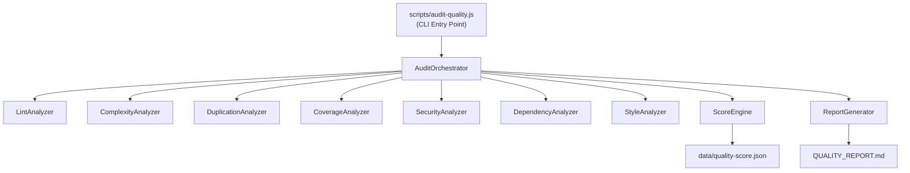

# Design-Dokument: Code-Qualitäts-Audit und Scoring-System

## Übersicht

Dieses Design beschreibt die technische Umsetzung eines Code-Qualitäts-Audit-Systems für die MeetEasier-Applikation. Das System besteht aus einem CLI-Skript (`scripts/audit-quality.js`), das verschiedene Analyse-Module orchestriert und einen gewichteten Qualitäts-Score (0–100) berechnet. Die Ergebnisse werden als JSON (`data/quality-score.json`) und als Markdown-Bericht (`QUALITY_REPORT.md`) ausgegeben.

Das Backend (Node.js/Express, `server.js`, `app/`, `config/`) verwendet CommonJS-Module, das Frontend (React, `ui-react/src/`) nutzt ES-Module mit Vite als Build-Tool und Vitest für Tests. Aktuell existiert keine ESLint-Konfiguration, keine Backend-Tests und kein Duplikations-Erkennungstool.

### Zentrale Design-Entscheidungen

1. **Modularer Aufbau**: Jede Audit-Kategorie wird als eigenständiges Modul implementiert, das ein einheitliches Interface (`analyze()` → `CategoryResult`) bereitstellt.
2. **Bestehende Tools nutzen**: ESLint, `cr` (complexity-report/typhonjs-escomplex), `jscpd` (Duplikation), Vitest Coverage, `npm audit` – statt eigener Implementierungen.
3. **Fehlertoleranz**: Jedes Modul fängt eigene Fehler ab; ein fehlgeschlagenes Modul stoppt nicht den gesamten Audit.
4. **Score-Berechnung als reine Funktion**: Die Score-Engine ist eine testbare, zustandslose Funktion ohne Seiteneffekte.

## Architektur



### Ablauf

1. CLI parst Argumente (`--fix`, `--verbose`)
2. `AuditOrchestrator` ruft alle Analyzer sequentiell auf
3. Jeder Analyzer gibt ein `CategoryResult` zurück
4. `ScoreEngine` berechnet Einzel- und Gesamt-Scores
5. `ReportGenerator` erzeugt JSON- und Markdown-Ausgaben
6. CLI gibt Zusammenfassung auf der Konsole aus

## Komponenten und Interfaces

### CategoryResult Interface

Jeder Analyzer liefert ein einheitliches Ergebnis:

```javascript
/**
 * @typedef {Object} Finding
 * @property {string} file - Betroffene Datei
 * @property {number} [line] - Zeilennummer
 * @property {string} message - Beschreibung des Problems
 * @property {'critical'|'high'|'medium'|'low'} severity - Schweregrad
 * @property {'small'|'medium'|'large'} effort - Geschätzter Aufwand
 * @property {string} [suggestion] - Verbesserungsvorschlag
 */

/**
 * @typedef {Object} CategoryResult
 * @property {string} category - Name der Kategorie
 * @property {number} score - Einzel-Score (0-100)
 * @property {Finding[]} findings - Gefundene Probleme
 * @property {Object} [metadata] - Zusätzliche Daten (z.B. Coverage-Zahlen)
 * @property {string|null} error - Fehlermeldung falls Analyse fehlschlug
 */
```

### Analyzer-Module

Alle Analyzer implementieren dasselbe Interface:

```javascript
/**
 * @param {AuditConfig} config
 * @returns {Promise<CategoryResult>}
 */
async function analyze(config) { ... }
```

#### 1. LintAnalyzer (`scripts/audit/lint-analyzer.js`)

- Führt ESLint programmatisch aus (via `ESLint` Node API)
- Backend: `app/**/*.js`, `config/**/*.js`, `server.js` mit Node.js-Regeln
- Frontend: `ui-react/src/**/*.{js,jsx}` mit React-Regeln
- Score-Berechnung: `100 - (errors * 2 + warnings * 0.5)`, Minimum 0
- Bei `--fix`: Nutzt ESLint Auto-Fix

#### 2. ComplexityAnalyzer (`scripts/audit/complexity-analyzer.js`)

- Nutzt `typhonjs-escomplex` zur Messung der zyklomatischen Komplexität
- Schwellenwerte: Komplexität > 15 = "hohe Komplexität", Datei > 500 Zeilen = "überdimensioniert"
- Score-Berechnung: Basiert auf dem Anteil der Funktionen unter dem Schwellenwert
- Spezialbehandlung für `app/routes.js`: Generiert Aufteilungsvorschläge

#### 3. DuplicationAnalyzer (`scripts/audit/duplication-analyzer.js`)

- Nutzt `jscpd` programmatisch (Mindestlänge: 6 Zeilen)
- Analysiert Backend und Frontend separat
- Besonderer Fokus auf Duplikate zwischen `app/routes.js` und `app/socket-controller.js`
- Score-Berechnung: `100 - (duplicatePercentage * 5)`, Minimum 0

#### 4. CoverageAnalyzer (`scripts/audit/coverage-analyzer.js`)

- Liest bestehende Vitest-Coverage-Daten aus `ui-react/coverage/coverage-final.json`
- Falls keine Coverage-Daten vorhanden: Führt `vitest run --coverage` aus
- Prüft ob Backend-Tests existieren (Suche nach `*.test.js` / `*.spec.js` in `app/`, `config/`)
- Score-Berechnung: Gewichteter Durchschnitt aus Statements, Branches, Functions, Lines
- Dateien unter 50% Coverage werden als "unzureichend getestet" markiert

#### 5. SecurityAnalyzer (`scripts/audit/security-analyzer.js`)

- Pattern-basierte Suche nach unsicheren Konstrukten: `eval()`, `Function()`, `innerHTML`-Zuweisungen
- Suche nach potenziellen Log-Leaks (Tokens, Passwörter in `console.log`/`console.error`)
- Prüfung der Helmet- und CORS-Konfiguration in `server.js`
- Führt `npm audit --json` für beide `package.json`-Dateien aus
- Score-Berechnung: Abzüge je nach Schweregrad der Findings

#### 6. DependencyAnalyzer (`scripts/audit/dependency-analyzer.js`)

- Führt `npm outdated --json` für Backend und Frontend aus
- Prüft auf deprecated Pakete (insbesondere `ews-javascript-api`)
- Zählt direkte und transitive Abhängigkeiten
- Score-Berechnung: Basiert auf dem Anteil aktueller Abhängigkeiten und Abwesenheit von Sicherheitslücken

#### 7. StyleAnalyzer (`scripts/audit/style-analyzer.js`)

- Prüft `.editorconfig`-Konformität (Indent-Style, Indent-Size, Charset)
- Erkennt gemischte Tabs/Spaces
- Prüft Benennungskonventionen in Dateinamen (camelCase vs. kebab-case)
- Erkennt gemischte Import-Muster (CommonJS vs. ES-Module pro Verzeichnis)
- Prüft auf fehlende JSDoc-Kommentare bei exportierten Funktionen
- Score-Berechnung: Basiert auf dem Anteil konformer Dateien

### ScoreEngine (`scripts/audit/score-engine.js`)

```javascript
const WEIGHTS = {
  linting: 0.20,
  complexity: 0.20,
  coverage: 0.20,
  security: 0.15,
  dependencies: 0.10,
  style: 0.15
};

/**
 * @param {Record<string, CategoryResult>} results
 * @returns {ScoreResult}
 */
function calculateScore(results) {
  const totalScore = Object.entries(WEIGHTS).reduce((sum, [key, weight]) => {
    const categoryScore = results[key]?.score ?? 0;
    return sum + (categoryScore * weight);
  }, 0);
  
  return {
    totalScore: Math.round(totalScore),
    categoryScores: Object.fromEntries(
      Object.keys(WEIGHTS).map(k => [k, results[k]?.score ?? 0])
    ),
    rating: getRating(totalScore),
    timestamp: new Date().toISOString()
  };
}

function getRating(score) {
  if (score >= 85) return 'Sehr gut';
  if (score >= 70) return 'Gut';
  if (score >= 50) return 'Verbesserungsbedürftig';
  return 'Kritisch';
}
```

### ReportGenerator (`scripts/audit/report-generator.js`)

- Erzeugt `data/quality-score.json` (maschinenlesbar)
- Erzeugt `QUALITY_REPORT.md` (menschenlesbar) mit:
  - Gesamt-Score und Bewertung
  - Einzel-Scores pro Kategorie
  - Alle Findings sortiert nach Schweregrad
  - Top-10 Quick Wins
  - Konkrete nächste Schritte pro Kategorie
- Sortiert Findings: Kritisch → Hoch → Mittel → Niedrig
- Sicherheits-Findings erhalten immer höchste Priorität

### AuditOrchestrator (`scripts/audit/orchestrator.js`)

- Koordiniert die Ausführung aller Analyzer
- Fängt Fehler einzelner Analyzer ab und setzt `error` im `CategoryResult`
- Übergibt Ergebnisse an ScoreEngine und ReportGenerator
- Gibt Konsolenzusammenfassung aus

## Datenmodelle

### AuditConfig

```javascript
/**
 * @typedef {Object} AuditConfig
 * @property {boolean} fix - Auto-Fix aktiviert
 * @property {boolean} verbose - Ausführliche Ausgabe
 * @property {string} rootDir - Projekt-Root-Verzeichnis
 * @property {Object} paths
 * @property {string[]} paths.backend - ['app/**/*.js', 'config/**/*.js', 'server.js']
 * @property {string[]} paths.frontend - ['ui-react/src/**/*.{js,jsx}']
 * @property {Object} thresholds
 * @property {number} thresholds.maxComplexity - 15
 * @property {number} thresholds.maxFileLines - 500
 * @property {number} thresholds.minCoverage - 50
 * @property {number} thresholds.minDuplicateLines - 6
 */
```

### ScoreResult

```javascript
/**
 * @typedef {Object} ScoreResult
 * @property {number} totalScore - Gesamt-Score (0-100)
 * @property {Record<string, number>} categoryScores - Einzel-Scores
 * @property {'Kritisch'|'Verbesserungsbedürftig'|'Gut'|'Sehr gut'} rating
 * @property {string} timestamp - ISO-8601 Zeitstempel
 */
```

### quality-score.json Struktur

```json
{
  "totalScore": 62,
  "rating": "Verbesserungsbedürftig",
  "categoryScores": {
    "linting": 45,
    "complexity": 70,
    "coverage": 55,
    "security": 80,
    "dependencies": 50,
    "style": 65
  },
  "findings": [
    {
      "file": "app/routes.js",
      "line": 42,
      "message": "Zyklomatische Komplexität von 23 überschreitet Schwellenwert 15",
      "severity": "high",
      "effort": "large",
      "category": "complexity",
      "suggestion": "Funktion in kleinere Hilfsfunktionen aufteilen"
    }
  ],
  "quickWins": [],
  "timestamp": "2025-01-15T10:30:00.000Z"
}
```

### ESLint-Konfigurationen

**Backend** (`.eslintrc.json` im Root):
```json
{
  "env": { "node": true, "es2022": true },
  "parserOptions": { "ecmaVersion": 2022 },
  "extends": ["eslint:recommended"],
  "rules": {
    "no-unused-vars": ["warn", { "argsIgnorePattern": "^_" }],
    "no-console": "off",
    "eqeqeq": "error",
    "complexity": ["warn", 15]
  }
}
```

**Frontend** (`ui-react/.eslintrc.json`):
```json
{
  "env": { "browser": true, "es2022": true },
  "parserOptions": { "ecmaVersion": 2022, "ecmaFeatures": { "jsx": true }, "sourceType": "module" },
  "extends": ["eslint:recommended", "plugin:react/recommended"],
  "plugins": ["react"],
  "settings": { "react": { "version": "detect" } },
  "rules": {
    "no-unused-vars": ["warn", { "argsIgnorePattern": "^_" }],
    "no-console": ["warn", { "allow": ["warn", "error"] }],
    "eqeqeq": "error",
    "react/prop-types": "warn"
  }
}
```

