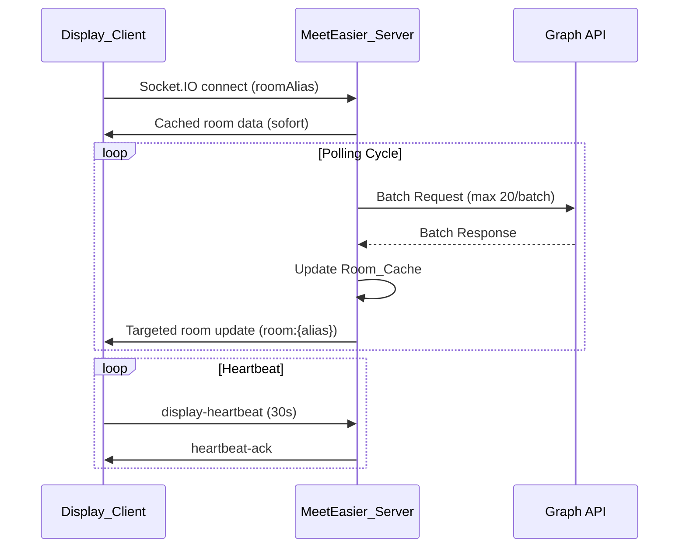

# Design Document

## Overview

Dieses Design beschreibt die technischen Änderungen zur Verbesserung der Performance und Stabilität der MeetEasier-Applikation. Die Änderungen betreffen drei Hauptbereiche:

1. **Server-Backend**: Graph-API-Batching, intelligentes Polling, Cache-Optimierung
2. **Client-Frontend**: Verbessertes Connection-Monitoring, Socket.IO-Reconnection, Memory-Management
3. **Netzwerk-Kommunikation**: Targeted Room Updates, Heartbeat-Optimierung, Asset-Caching

## Architecture

### Betroffene Komponenten

```
┌─────────────────────────────────────────────────────┐
│  Display_Client (Raspberry Pi / TouchKio)            │
│  ┌──────────────┐  ┌─────────────────────────────┐  │
│  │ Connection   │  │ Socket.IO Client             │  │
│  │ Monitor v2   │  │ (Reconnection + Heartbeat)   │  │
│  └──────────────┘  └─────────────────────────────┘  │
└─────────────────────────────────────────────────────┘
                        │ WebSocket
                        ▼
┌─────────────────────────────────────────────────────┐
│  MeetEasier_Server (Node.js)                         │
│  ┌──────────────────┐  ┌────────────────────────┐   │
│  │ Socket_Controller │  │ Graph_Poller           │   │
│  │ (Targeted Updates)│  │ (Batch + Adaptive)     │   │
│  └──────────────────┘  └────────────────────────┘   │
│  ┌──────────────────┐  ┌────────────────────────┐   │
│  │ Room_Cache        │  │ Express Static Server  │   │
│  │ (In-Memory)       │  │ (Optimierte Headers)   │   │
│  └──────────────────┘  └────────────────────────┘   │
└─────────────────────────────────────────────────────┘
                        │ HTTPS
                        ▼
┌─────────────────────────────────────────────────────┐
│  Microsoft Graph API (Batch Endpoint)                │
└─────────────────────────────────────────────────────┘
```

### Datenfluss



## Components and Interfaces

### 1. Graph-API-Batching (Requirement 1)

**Aktueller Zustand**: `app/msgraph/rooms.js` ruft `graph.getCalendarView()` einzeln pro Raum auf mit `Promise.all`. Bei 50 Räumen sind das 50 parallele HTTP-Requests.

**Neuer Zustand**: Verwendung von `graph.getCalendarViewBatch()` (existiert bereits in `app/msgraph/graph.js`) als primäre Methode im Polling-Flow.

**Änderungen in `app/msgraph/rooms.js`**:
- Statt `Promise.all(rooms.map(room => graph.getCalendarView(...)))` wird `graph.getCalendarViewBatch(msalClient, emails)` aufgerufen
- Batch-Ergebnisse werden den Room-Objekten zugeordnet
- Bei Batch-Fehlern einzelner Räume wird `room.ErrorMessage` gesetzt
- Fallback auf Einzel-Requests nur bei komplettem Batch-API-Fehler (z.B. Auth-Problem)

**Schnittstelle**:
```javascript
// rooms.js - Neuer Ansatz
const emails = rooms.map(r => r.Email);
const batchResults = await graph.getCalendarViewBatch(msalClient, emails);

for (const room of rooms) {
  const result = batchResults.get(room.Email);
  if (result?.error) {
    room.ErrorMessage = toClientRoomErrorMessage({ message: result.error });
  } else if (result?.value) {
    // Process appointments...
  }
}
```

### 2. Intelligentes Polling (Requirement 2)

**Änderungen in `app/socket-controller.js`**:

- **Pause bei null Clients**: Der `fetchAndBroadcastRooms()`-Call prüft zu Beginn, ob `connectedDisplayClients.size > 0`. Falls nicht, wird der Zyklus übersprungen.
- **Performance-Warnung**: Nach jedem Polling-Zyklus wird die Dauer gemessen. Wenn `duration > 0.8 * pollInterval`, wird ein Warning geloggt.
- **Sequential Guarantee**: Die bestehende Logik (`isRunning`-Flag) verhindert bereits parallele Zyklen. Dies wird beibehalten.

### 3. Verbessertes Connection-Monitoring (Requirement 3)

**Änderungen in `ui-react/src/utils/connection-monitor.js`**:

- **3-Strikes-Regel**: Neues Feld `consecutiveFailures`. Erst bei `consecutiveFailures >= 3` wird `handleOffline()` aufgerufen.
- **Socket.IO-Integration**: Neue Methode `setSocketActive(isActive)`. Wenn Socket.IO verbunden ist und Daten liefert, wird der Monitor auf "online" gesetzt, unabhängig von Health-Check-Ergebnissen.
- **Schnelleres Recovery**: Bei erfolgreichem Health-Check wird `consecutiveFailures` sofort auf 0 gesetzt und Offline-Status innerhalb des nächsten Check-Intervalls (5s) entfernt.

**Schnittstelle**:
```javascript
class ConnectionMonitor {
  consecutiveFailures = 0;
  requiredFailures = 3;
  socketActive = false;

  setSocketActive(active) {
    this.socketActive = active;
    if (active && !this.isOnline) {
      this.handleOnline();
    }
  }

  async checkConnection() {
    if (response.ok) {
      this.consecutiveFailures = 0;
      if (!this.isOnline) this.handleOnline();
    } else {
      this.consecutiveFailures++;
      if (this.consecutiveFailures >= this.requiredFailures && !this.socketActive) {
        this.handleOffline();
      }
    }
  }
}
```

### 4. Socket.IO Reconnection-Robustheit (Requirement 4)

**Änderungen in Display-Komponenten** (`Display.jsx`, `Flightboard.jsx`):

- **Sofortige Cache-Lieferung bei Reconnect**: Server-seitig in `socket-controller.js`: Beim `connection`-Event wird sofort `lastRoomsCache` an den Client gesendet.
- **Reconnect-Unterscheidung**: Kurze Disconnects (<30s) → nur Data-Refresh via Socket. Lange Disconnects (>120s) → Full Page Reload. Mittlere Disconnects (30-120s) → Data-Refresh + State-Reset.
- **Last-Known-Data anzeigen**: `_wasDisconnected`-State zeigt weiterhin die letzten bekannten Daten an.

**Server-Schnittstelle in `socket-controller.js`**:
```javascript
socket.on('connection', () => {
  if (lastRoomsCache) {
    const roomAlias = socket.handshake.query.roomAlias;
    if (roomAlias) {
      const room = lastRoomsCache.find(r => r.RoomAlias === roomAlias);
      if (room) socket.emit('updatedRoom', room);
    } else {
      socket.emit('updatedRooms', lastRoomsCache);
    }
  }
});
```

### 5. Targeted Room Updates (Requirement 8)

**Aktueller Zustand**: `broadcastRoomUpdates()` sendet bereits individuelle Updates an `room:${alias}` UND das Full-Array an alle.

**Änderung Client-seitig**: Display-Komponenten hören nur noch auf `updatedRoom` (Singular) wenn sie mit einem roomAlias verbunden sind. Das `updatedRooms`-Event wird nur vom Flightboard verarbeitet.

### 6. Heartbeat-Mechanismus (Requirement 7)

**Änderungen**: Ergänzung eines `heartbeat-ack` Events als Response auf `display-heartbeat`. Server markiert Client nach 90s ohne Heartbeat als `potentiallyDisconnected`.

### Zu ändernde Dateien

| Datei | Änderungstyp | Beschreibung |
|-------|-------------|--------------|
| `app/msgraph/rooms.js` | Refactoring | Umstellung auf Batch-API |
| `app/socket-controller.js` | Erweiterung | Pause-Polling, Immediate-Cache-Delivery, Performance-Logging |
| `ui-react/src/utils/connection-monitor.js` | Refactoring | 3-Strikes-Regel, Socket.IO-Integration |
| `ui-react/src/components/single-room/Display.jsx` | Anpassung | Targeted Events, Reconnect-Logik |
| `ui-react/src/components/flightboard/Flightboard.jsx` | Anpassung | Targeted Events |
| `ui-react/src/components/shared/display-utils.js` | Erweiterung | Heartbeat-ACK-Handling |

### Nicht zu ändernde Dateien

| Datei | Begründung |
|-------|------------|
| `app/msgraph/graph.js` | `getCalendarViewBatch` existiert bereits vollständig |
| `server.js` | Socket.IO-Timeouts und Static-File-Headers sind bereits korrekt konfiguriert |
| `config/config.js` | Polling-Konfiguration wird bereits aus ENV gelesen |

## Data Models

### Room_Cache Struktur

Der serverseitige In-Memory-Cache speichert die aktuellsten erfolgreich abgerufenen Raumdaten:

```javascript
// socket-controller.js
let lastRoomsCache = null;       // Array<RoomData> | null
let lastRoomsCacheTime = null;   // number (Date.now() timestamp)

// RoomData Objekt
{
  RoomAlias: string,            // z.B. "meeting-room-1"
  RoomName: string,             // z.B. "Meetingraum 1. OG"
  Email: string,                // z.B. "room1@company.com"
  Busy: boolean,                // Aktueller Belegungsstatus
  BusyStatus: string,           // "Free" | "Busy" | "Tentative"
  Appointments: Array<{
    Subject: string,
    Organizer: string,
    Start: string,              // ISO DateTime
    End: string                 // ISO DateTime
  }>,
  ErrorMessage: string | null,  // Fehler bei Graph-Abfrage
  LastSync: string              // ISO DateTime des letzten erfolgreichen Abrufs
}
```

### API-Response mit Stale-Indikator

```javascript
// GET /api/rooms Response
{
  rooms: Array<RoomData>,
  stale: boolean,               // true wenn Cache älter als 180s
  lastSync: string              // ISO DateTime
}
```

### Display Client Tracking (Server-seitig)

```javascript
// connectedDisplayClients Map
Map<socketId, {
  socketId: string,
  roomAlias: string | null,     // null für Flightboard-Clients
  connectedAt: number,          // Date.now() timestamp
  lastSeenAt: number,           // Letzter Heartbeat-Timestamp
  potentiallyDisconnected: boolean,
  clientType: "single-room" | "flightboard" | "admin"
}>

// recentDisconnects Array (max 50 Einträge)
Array<{
  socketId: string,
  roomAlias: string | null,
  disconnectedAt: number,
  reason: string
}>
```

### Connection-Monitor State (Client-seitig)

```javascript
{
  isOnline: boolean,
  socketActive: boolean,
  consecutiveFailures: number,  // 0-3+
  requiredFailures: 3,
  lastCheckTime: number,
  offlineSince: number | null,  // Timestamp wann offline erkannt
  checkInterval: 5000           // ms
}
```

## Correctness Properties

*A property is a characteristic or behavior that should hold true across all valid executions of a system — essentially, a formal statement about what the system should do. Properties serve as the bridge between human-readable specifications and machine-verifiable correctness guarantees.*

### Property 1: Batch size invariant

*For any* set of rooms to be polled, the batching function SHALL partition them into batches where each batch contains at most 20 requests.

**Validates: Requirements 1.1**

### Property 2: Batch error isolation

*For any* batch response containing a mix of successful and failed individual requests, only the rooms corresponding to failed requests SHALL be marked with an error, while all other rooms SHALL be processed successfully.

**Validates: Requirements 1.2**

### Property 3: Server retry exponential backoff

*For any* sequence of timeout failures, the retry delay SHALL follow exponential backoff (doubling each attempt) up to the configured retry limit, after which no further retries SHALL occur.

**Validates: Requirements 1.4**

### Property 4: Performance warning threshold

*For any* polling cycle with duration D and configured interval I, a performance warning SHALL be logged if and only if D > 0.8 * I.

**Validates: Requirements 2.2**

### Property 5: Three-strikes offline detection

*For any* sequence of health check results, the offline indicator SHALL be shown if and only if there are 3 or more consecutive failures AND the socket is not active.

**Validates: Requirements 3.1, 3.4**

### Property 6: Long offline triggers reload

*For any* offline duration exceeding 60 seconds followed by a reconnect, the Display_Client SHALL trigger a full page reload.

**Validates: Requirements 3.5**

### Property 7: Client reconnection exponential backoff

*For any* reconnection attempt number N, the backoff delay SHALL equal min(2^(N-1) * 1000, 30000) milliseconds.

**Validates: Requirements 4.1**

### Property 8: Short disconnect immediate cache delivery

*For any* client reconnecting after a disconnect shorter than 30 seconds, the server SHALL immediately resend cached room data without waiting for the next polling cycle.

**Validates: Requirements 4.2**

### Property 9: Long disconnect full reload

*For any* disconnect lasting more than 120 seconds without successful reconnection, the Display_Client SHALL perform a full page reload.

**Validates: Requirements 4.4**

### Property 10: Cache integrity on failure

*For any* sequence of polling results, the Room_Cache SHALL always contain the data from the last successful fetch and SHALL never be overwritten by failed fetch results or empty data.

**Validates: Requirements 5.1, 9.4**

### Property 11: Cache staleness detection

*For any* Room_Cache with age greater than 180 seconds since the last successful poll, the sync status SHALL be marked as stale.

**Validates: Requirements 5.3**

### Property 12: Bounded disconnect log with eviction

*For any* number of disconnect events, the disconnect log SHALL never exceed 50 entries, and when the limit is reached, the oldest entries SHALL be discarded first.

**Validates: Requirements 6.3, 6.4**

### Property 13: Heartbeat updates lastSeenAt

*For any* display client sending a heartbeat, the server SHALL update that client's lastSeenAt timestamp to the current time.

**Validates: Requirements 7.2**

### Property 14: Missing heartbeat marks client

*For any* display client whose lastSeenAt timestamp is more than 90 seconds in the past, the server SHALL mark that client as potentially disconnected.

**Validates: Requirements 7.3**

### Property 15: Room alias channel routing

*For any* display client connecting with a room alias, the client SHALL be added to the Socket.IO room "room:{alias}", and subsequent room data updates SHALL be emitted to that specific channel.

**Validates: Requirements 8.1, 8.2**

### Property 16: Consecutive failures trigger maintenance mode

*For any* sequence of polling results, automatic maintenance mode SHALL be activated if and only if there are 3 or more consecutive failures.

**Validates: Requirements 9.1**

## Error Handling

### Graph-API-Fehler

| Fehlertyp | Verhalten |
|-----------|-----------|
| Einzelner Raum im Batch fehlgeschlagen | Nur dieser Raum erhält `ErrorMessage`, Rest wird normal verarbeitet |
| Gesamter Batch-Request fehlgeschlagen (Auth, Netzwerk) | Fallback auf Einzel-Requests; bei erneutem Fehler → Cache beibehalten |
| 3 konsekutive Polling-Fehler | Automatischer Maintenance-Mode aktiviert, Clients werden informiert |
| Timeout | Retry mit exponential Backoff (max. konfigurierte Anzahl) |

### Socket.IO-Fehler

| Fehlertyp | Verhalten |
|-----------|-----------|
| Client-Disconnect (kurz, <30s) | Server sendet Cache-Daten sofort bei Reconnect |
| Client-Disconnect (mittel, 30-120s) | Data-Refresh + State-Reset |
| Client-Disconnect (lang, >120s) | Full Page Reload |
| Server nicht erreichbar | 3-Strikes-Regel bevor Offline-Anzeige, weiterhin letzte bekannte Daten anzeigen |

### Memory-Overflow-Schutz

| Ressource | Schutzmechanismus |
|-----------|-------------------|
| Disconnect-Log | Max 50 Einträge, FIFO-Eviction |
| Display-Client-Tracking | Cleanup alter Einträge via `cleanupOldDisplays()` |
| Browser-Speicher | Täglicher Auto-Reload (Standard: 03:00) |

## Risiken und Mitigationen

| Risiko | Mitigation |
|--------|-----------|
| Batch-API-Fehler beeinträchtigt alle Räume | Fallback auf Einzel-Requests bei Batch-Level-Fehler |
| 3-Strikes-Regel verzögert echte Offline-Erkennung um 15s | Akzeptabler Tradeoff – falsche Offlines sind schlimmer |
| Immediate-Cache-Delivery sendet veraltete Daten | Stale-Indikator wird mitgeliefert, nächster Polling-Zyklus korrigiert |
| Memory-Leaks durch Socket.IO Event-Listener | Bestehende Cleanup-Mechanismen beibehalten, explizites Entfernen in `componentWillUnmount` |

## Testing Strategy

### Property-Based Tests (PBT)

Property-basierte Tests verwenden die Bibliothek **fast-check** für JavaScript/TypeScript. Jede Correctness Property wird als einzelner Property-Test implementiert mit mindestens 100 Iterationen.

**Tagging-Format**: `Feature: performance-stability-improvements, Property {number}: {property_text}`

**PBT-geeignete Bereiche**:
- Batch-Partitionierung (Property 1)
- Fehler-Isolation in Batch-Responses (Property 2)
- Exponential-Backoff-Berechnung (Properties 3, 7)
- Schwellwert-basierte Entscheidungen (Properties 4, 5, 6, 9, 11, 14, 16)
- Cache-Invarianten (Properties 10, 12)
- Channel-Routing (Property 15)

### Unit Tests (Beispiel-basiert)

- **Polling-Pause**: 0 Clients → kein Graph-Aufruf; 1 Client → Polling läuft
- **Webhook-Intervall**: Webhook aktiv → 300s Intervall
- **Room-Registration**: Client mit Alias → korrektes Socket.IO Room Join
- **Maintenance-Recovery**: Erfolg nach Fehlern → Maintenance-Mode deaktiviert
- **Stale-Response**: API-Response enthält `stale: true` wenn Cache alt

### Integration Tests

- **Cache-Delivery**: Client-Connect → sofortige Daten innerhalb 500ms
- **Polling-Performance**: 50 Räume mit Batch → Zyklus unter 5 Sekunden
- **Auto-Reload**: Scheduled Reload wird zur konfigurierten Zeit ausgeführt

### Smoke Tests

- Socket.IO pingTimeout = 60000, pingInterval = 25000
- Heartbeat-Intervall = 30s
- Cache-Control Header korrekt für JS/CSS, Images/Fonts, HTML
- Vite-Build erzeugt content-hashed Dateinamen
