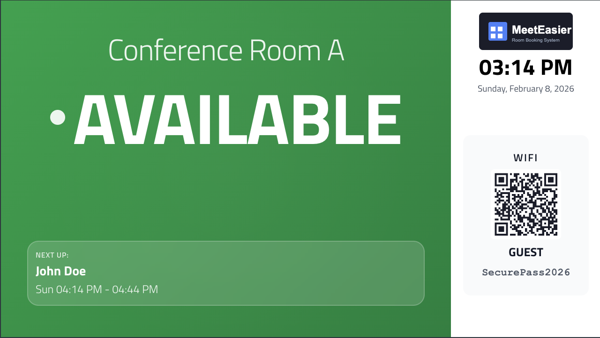
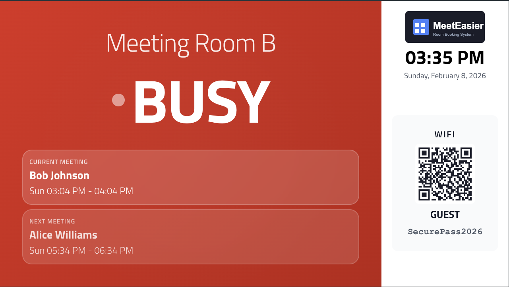
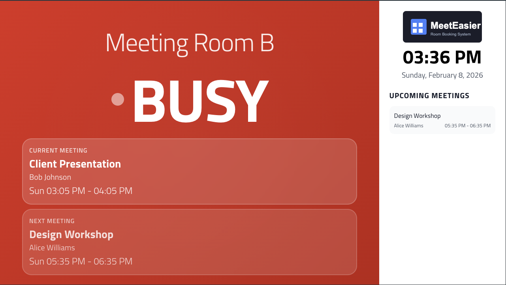
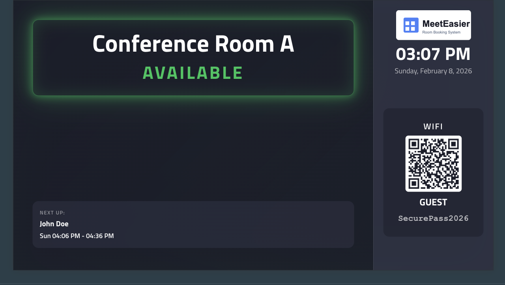
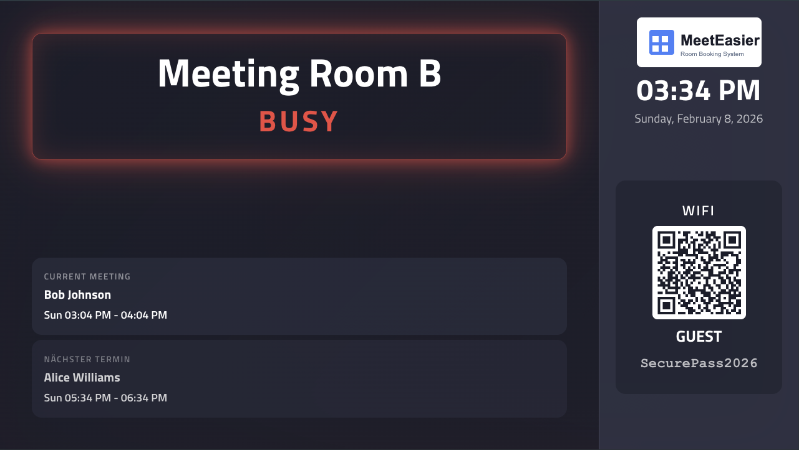
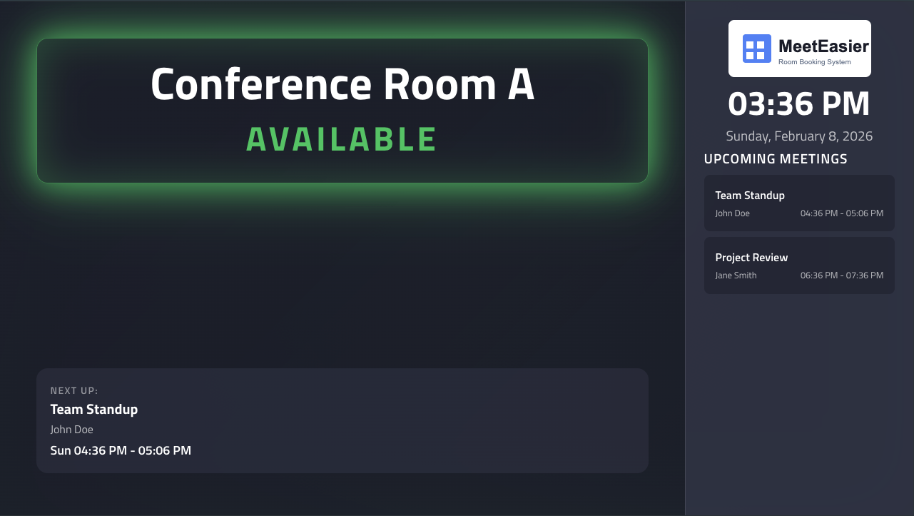
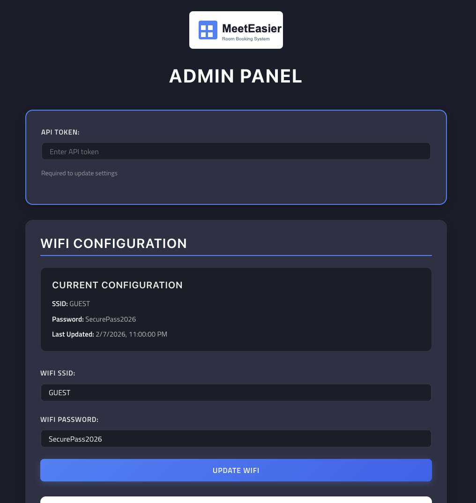

# MeetEasier

Because why pay money for something you can do yourself?

> **Note:** This project is based on the excellent work by [danxfisher/MeetEasier](https://github.com/danxfisher/MeetEasier). 
> Many thanks to [@danxfisher](https://github.com/danxfisher) for creating the original MeetEasier and making it open source!
> 
> This fork includes significant enhancements including a room booking feature, modern UI redesign, multi-language support, 
> and comprehensive admin panel.

## Description

MeetEasier is a web application that visualizes meeting room availability. It works using Microsoft Graph API in Microsoft 365.

**Note: The Exchange Web Services (EWS) is deprecated and will be removed in the future.**

## Quick Start

📚 **[Installation Guide](INSTALLATION.md)** - Complete step-by-step installation instructions

📖 **[Configuration Reference](CONFIGURATION.md)** - Detailed configuration options and settings

🔒 **[Security Policy](SECURITY.md)** - Security best practices and vulnerability reporting

---

## Screenshots

### Flightboard View
Overview of all meeting rooms with their current status and upcoming meetings.


### Single Room Display
Detailed view for individual meeting rooms showing current and upcoming meetings.

**Available Room:**


**Busy Room:**


**With Meeting Titles:**


### Room Minimal Display
Compact display perfect for smaller screens or door-mounted tablets.

**Available Room:**


**Busy Room:**


**With Meeting Titles:**


### WiFi Information Display
Dedicated WiFi information page with QR code for easy network access.


### Admin Panel
Comprehensive admin panel for managing WiFi, logos, sidebar settings, and booking configuration.



---

## License

MeetEasier is licensed under the open source [GNU General Public License (GPL 3.0)](https://github.com/danxfisher/MeetEasier/blob/master/LICENSE).

In the event of wanting to commercially distribute a closed source modification of this code, please contact me.

---

## Version

**Current Version:** 1.1.0

For detailed version history and changelog, see [CHANGELOG.md](CHANGELOG.md).

---

## Requirements

This application requires:

- **Node.js 20+** and **npm 9+**
- Microsoft Graph API (Microsoft 365)
- Conference room mailboxes organized in room lists
- A registered application in Azure AD (see [here](#setup-the-application-in-microsoft-365) for more information)
- A web server to run the application

**Security Note:** This application uses OAuth2 with Microsoft Graph API for secure authentication. Admin endpoints are protected by API token authentication.

**New Dependencies:**
- `qrcode` - For WiFi QR code generation
- `multer` - For logo file uploads
- `socket.io` - For real-time updates

**Booking Feature:**
- Rooms can be booked directly from single-room and room-minimal displays
- Uses Microsoft Graph API to create calendar events
- Room acts as the organizer of the booking
- Requires Calendars.ReadWrite application permission in Azure AD
- **Automatic permission detection**: If Calendars.ReadWrite is missing, booking is automatically disabled
- Admin panel shows warning when permission is missing

---

## Installation

1. **Prerequisites**: Ensure Node.js 20+ and npm 9+ are installed
   ```bash
   node --version  # Should be 20+
   npm --version   # Should be 9+
   ```

2. **Install dependencies**:
   ```bash
   npm install
   ```

3. **Configure environment**: Copy and edit the environment file
   ```bash
   cp .env.template .env
   # Edit .env with your Microsoft Graph API credentials
   ```

4. **Build the application**:
   ```bash
   npm run build
   ```

5. **Start the server**:
   ```bash
   npm start
   ```

6. **Development mode** (optional):
   ```bash
   npm run start-ui-dev
   ```

## Docker Installation

### Quick Start

Build and run with Docker:

```bash
docker build --build-arg OAUTH_CLIENT_ID=your_client_id \
             --build-arg OAUTH_AUTHORITY=https://login.microsoftonline.com/your_tenant_id \
             --build-arg OAUTH_CLIENT_SECRET=your_client_secret \
             -t meeteasier .

docker run -d -p 8080:8080 \
  -v $(pwd)/data:/opt/meeteasier/data \
  -v $(pwd)/static/img/uploads:/opt/meeteasier/static/img/uploads \
  --name meeteasier \
  meeteasier
```

### Persistent Storage

To persist configuration and uploaded logos across container restarts, mount these volumes:

- **`/opt/meeteasier/data`** - Configuration files (WiFi, logo, sidebar settings)
- **`/opt/meeteasier/static/img/uploads`** - Uploaded logo files

**Example with Docker Compose:**

```yaml
version: '3.8'

services:
  meeteasier:
    build:
      context: .
      args:
        OAUTH_CLIENT_ID: ${OAUTH_CLIENT_ID}
        OAUTH_AUTHORITY: ${OAUTH_AUTHORITY}
        OAUTH_CLIENT_SECRET: ${OAUTH_CLIENT_SECRET}
    ports:
      - "8080:8080"
    volumes:
      - ./data:/opt/meeteasier/data
      - ./static/img/uploads:/opt/meeteasier/static/img/uploads
    environment:
      - API_TOKEN=${API_TOKEN}
      - WIFI_SSID=${WIFI_SSID}
      - WIFI_PASSWORD=${WIFI_PASSWORD}
      - LOGO_DARK_URL=${LOGO_DARK_URL}
      - LOGO_LIGHT_URL=${LOGO_LIGHT_URL}
    restart: unless-stopped
```

### Security Features

The Docker image includes several security enhancements:

- ✅ **npm removed after build** - Reduces CVE attack surface
- ✅ **Non-root user** - Runs as user `nodejs` (UID 1001)
- ✅ **Alpine Linux base** - Minimal attack surface
- ✅ **Security updates** - Latest Alpine packages
- ✅ **Production dependencies only** - No dev dependencies included

### Environment Variables

All configuration can be provided via environment variables:

```bash
docker run -d -p 8080:8080 \
  -e OAUTH_CLIENT_ID=your_client_id \
  -e OAUTH_AUTHORITY=https://login.microsoftonline.com/your_tenant_id \
  -e OAUTH_CLIENT_SECRET=your_client_secret \
  -e API_TOKEN=your_secure_token \
  -e WIFI_SSID=your_wifi_network \
  -e WIFI_PASSWORD=your_wifi_password \
  -e LOGO_DARK_URL=/img/logo-dark.svg \
  -e LOGO_LIGHT_URL=/img/logo-light.svg \
  -e SIDEBAR_SHOW_WIFI=true \
  -e SIDEBAR_SHOW_UPCOMING=false \
  -e SIDEBAR_SHOW_TITLES=false \
  -v $(pwd)/data:/opt/meeteasier/data \
  -v $(pwd)/static/img/uploads:/opt/meeteasier/static/img/uploads \
  --name meeteasier \
  meeteasier
```

**Note:** When environment variables are set, the corresponding admin panel sections will be hidden to prevent accidental changes.

---

## Root Folder Structure Explained

- `app/` : Routes for MSGRAPH and EWS APIs
- `app/ews/` : All EWS functionality (deprecated)
- `app/msgraph/` : All Microsoft Graph functionality with pagination support
- `app/wifi-manager.js` : WiFi configuration and QR code management
- `app/socket-controller.js` : Real-time updates via Socket.IO
- `config/` : All server side configuration settings
- `data/` : Configuration files (wifi-config.json, logo-config.json)
- `scss/` : All styles (modern design system with @use modules)
- `static/` : All global static files
- `static/img/uploads/` : Uploaded logo files
- `ui-react/` : Front end React routes and components

---

## React /src Folder Structure Explained

There are four main directories in the `ui-react/src/` folder:

- `components/` : Components separated in folders by function
- `config/` : Customizable config files with multi-language support
- `layouts/` : Layout components for different display types
- `utils/` : Utility functions (time formatting, language detection)

### Components

- `flightboard/` : All components related to the flightboard or "all meeting" layout
- `global/` : Components that will be used by multiple layouts
- `single-room/` : All components related to the Single Room layout
- `room-outside/` : Components for the compact room outside display
- `wifi/` : WiFi information display component
- `admin/` : Admin panel for WiFi and logo management

#### components/flightboard/

- `Flightboard` : Main flightboard component with modern dark theme
- `FlightboardRow` : Individual room row with status indicators
- `Clock` : Clock component with locale-aware time formatting
- `Navbar` : Top navigation/title bar with logo
- `RoomFilter` : Room list filter dropdown with URL parameter support
- `RoomFilterContainer` : Container managing filter state

#### components/global/

- `NotFound` : A "not found" page if an error or "404" occurs
- `Socket` : Service component for web socket connection and real-time updates
- `Spinner` : Loading spinner component

#### components/single-room/

- `Display` : Main single room display with modern gradient backgrounds
- `RoomStatusBlock` : Status display with animated indicators
- `Sidebar` : Sidebar with clock, WiFi info, and upcoming meetings
- `Clock` : Clock component with locale-aware formatting

#### components/room-outside/

- `RoomStatusBlock` : Compact status display for outside room
- `Sidebar` : Compact sidebar with WiFi information
- `Clock` : Clock component

#### components/wifi/

- `WiFiInfo` : Public WiFi information display with QR code

#### components/admin/

- `Admin` : Comprehensive admin panel for WiFi and logo management
  - WiFi configuration with QR code generation
  - Logo management (dark and light logos)
  - File upload support
  - URL input support
  - Real-time preview

### Config

- `flightboard.config.js` : Flightboard customization with multi-language support
- `singleRoom.config.js` : Single room display customization with translations
- `flightboard.seats.js` : Room capacity configuration

### Utils

- `timeFormat.js` : Locale-aware time formatting utilities

### Layouts

- `FlightboardLayout` : Layout for flightboard display
- `SingleRoomLayout` : Layout for single room display
- `RoomOutside` : Layout for compact room outside display
- `WiFiInfoLayout` : Layout for WiFi information page
- `AdminLayout` : Layout for admin panel

---

## Authentication

### Setup the application in Microsoft 365

1. Login to the Microsoft 365 admin center
2. Go to the "Azure Active Directory" admin center
3. Go to "App Registrations"
4. Click "New Registration"
5. Enter a name for the application, e.g. "MeetEasier"
6. Select "Accounts in this organizational directory only", and leave everything else default
7. Click "Register"
8. Copy the "Application (client) ID" and save it for later
9. Copy the "Directory (tenant) ID" and save it for later
10. Click "Certificates & secrets"
11. Click "New client secret"
12. Enter a description, e.g. "MeetEasier secret"
13. Set the expiration to "Custom" and set to however long you want the secret to last
14. Click "Add"
15. Copy the secret and save it for later
16. Click "API permissions"
17. Click "Add a permission"
18. Select "Microsoft Graph"
19. Select "Application permissions"
20. Select "Calendars.Read, Calendars.ReadWrite, Place.Read.All, User.Read.All"
21. Click "Add permissions"
22. Click "Grant admin consent for your tenant"
23. Click "Yes"

And you're done!

### Configure the application

Use a .env file (recommended method). See .env.template for all available variables.

1. **Copy the template**:
   ```bash
   cp .env.template .env
   ```

2. **Edit .env file** with your values:
   ```bash
   # Microsoft Graph API Configuration
   OAUTH_CLIENT_ID=your-client-id-from-step-8
   OAUTH_AUTHORITY=https://login.microsoftonline.com/your-tenant-id-from-step-9
   OAUTH_CLIENT_SECRET=your-client-secret-from-step-15
   
   # Search Configuration
   SEARCH_USE_GRAPHAPI=true
   SEARCH_MAXROOMLISTS=50
   SEARCH_MAXROOMS=50
   SEARCH_MAXDAYS=10
   SEARCH_MAXITEMS=100
   
   # WiFi Configuration (for single room displays)
   SSID=your-wifi-network
   PSK=your-wifi-password
   
   # Booking Configuration
   ENABLE_BOOKING=true
   
   # Admin API Security
   API_TOKEN=generate-a-secure-random-token-here
   ```

**Note:** 
- EWS (Exchange Web Services) variables are deprecated and no longer needed.
- The API_TOKEN is required to protect admin endpoints. Generate a secure random token (64+ characters recommended).
- Microsoft Graph API now supports pagination, so MAXROOMS and MAXITEMS can be set higher than the API's 30-item limit.

---

## Admin Panel

Access the admin panel at `/admin` to manage WiFi and logo configurations.

### Features

**WiFi Management:**
- Update WiFi SSID and password
- Automatic QR code generation
- Real-time updates to all connected displays
- Public WiFi information page at `/wifi-info`

**Logo Management:**
- Separate dark and light logo support
- Upload logo files (JPG, PNG, GIF, SVG, WebP, max 5MB)
- Or provide logo URLs
- Real-time updates across all pages
- Side-by-side preview

**Sidebar Configuration:**
- Choose between WiFi information or upcoming meetings display
- Toggle meeting title visibility
- Real-time updates to room displays

**Booking Configuration:**
- Enable/disable room booking feature
- Control via admin panel or environment variable
- Quick booking (15/30/60 minutes) or custom time selection
- Automatic conflict detection
- Multi-language support (German/English)
- Booking button appears in sidebar when room is available

**Security:**
- Protected by API token authentication
- Set API_TOKEN in .env file
- Token required in Authorization header or X-API-Token header

**Environment Variable Configuration:**
- Settings can be configured via .env file
- When environment variables are set, corresponding admin panel sections are hidden
- Prevents accidental changes to production settings
- See .env.template for available options

### API Endpoints

**WiFi:**
- `GET /api/wifi` - Get current WiFi configuration (public)
- `POST /api/wifi` - Update WiFi configuration (requires token)

**Logo:**
- `GET /api/logo` - Get current logo configuration (public)
- `POST /api/logo` - Update logo URLs (requires token)
- `POST /api/logo/upload` - Upload logo file (requires token)

**Sidebar:**
- `GET /api/sidebar` - Get current sidebar configuration (public)
- `POST /api/sidebar` - Update sidebar configuration (requires token)

**Booking:**
- `GET /api/booking-config` - Get booking configuration (public)
- `POST /api/booking-config` - Update booking configuration (requires token)
- `POST /api/book/:roomEmail` - Book a room (public, requires room availability)

**Configuration Locks:**
- `GET /api/config-locks` - Check which settings are locked by environment variables (public)

---

## New Features

### Modern Design System

- Complete UI redesign with modern aesthetics
- Dark theme for flightboard
- Gradient backgrounds for room displays (green=available, red=busy, amber=upcoming)
- Animated status indicators with pulsing effects
- Consistent spacing, typography, and color system
- Responsive design for various screen sizes

### Room Booking

- Direct booking from single-room and room-minimal displays
- Quick booking buttons (15/30/60 minutes)
- Custom time selection with 15-minute intervals
- Automatic end time calculation (+15 minutes from start)
- Meeting subject auto-filled based on browser language
- Conflict detection prevents double-booking
- Fully translated interface (German/English)
- Responsive modal design with dark theme support
- Booking button positioned in sidebar for consistent layout
- Enable/disable via admin panel or ENABLE_BOOKING environment variable

### Multi-Language Support

- Automatic browser language detection
- German and English translations
- Locale-aware time formatting (12h/24h)
- Configurable text in config files

### Real-Time Updates

- Socket.IO integration for instant updates
- WiFi configuration changes propagate immediately
- Logo changes update across all displays
- No page refresh required

### URL-Based Filtering

- Flightboard supports filter query parameter
- Example: `/?filter=roomlist-name`
- Dropdown syncs with URL parameter
- Shareable filtered views

### Pagination Support

- Microsoft Graph API pagination implemented
- Automatically handles 30-item API limit
- Fetches all pages of results
- Supports large room lists and calendars

---

## Customization

### Simple

- In `/config/room-blacklist.js`, add any room by email to exclude it from the list of rooms:

  ```javascript
  module.exports = {
    roomEmails: ["ROOM_EMAIL@DOMAIN.com"],
  };
  ```

- In `/ui-react/src/config/flightboard.config.js`, manage your customizations with multi-language support:

  ```javascript
  const getLanguage = () => {
    const browserLang = navigator.language || navigator.userLanguage;
    return browserLang.split('-')[0];
  };

  const translations = {
    de: {
      nextUp: "Als nächstes",
      statusAvailable: "Frei",
      statusBusy: "Belegt",
      statusError: "Fehler",
      title: "Konferenzräume",
      filterTitle: "Standorte",
      filterAllTitle: "Alle Konferenzräume",
      seats: "Plätze"
    },
    en: {
      nextUp: "Next Up",
      statusAvailable: "Available",
      statusBusy: "Busy",
      statusError: "Error",
      title: "Conference Rooms",
      filterTitle: "Locations",
      filterAllTitle: "All Conference Rooms",
      seats: "Seats"
    }
  };

  const lang = getLanguage();
  const t = translations[lang] || translations.en;

  module.exports = {
    board: {
      nextUp: t.nextUp,
      statusAvailable: t.statusAvailable,
      statusBusy: t.statusBusy,
      statusError: t.statusError,
    },
    navbar: {
      title: t.title,
    },
    roomFilter: {
      filterTitle: t.filterTitle,
      filterAllTitle: t.filterAllTitle,
    },
  };
  ```

- Manage logos through the admin panel at `/admin`:
  - Upload dark logo (for light backgrounds)
  - Upload light logo (for dark backgrounds)
  - Or provide URLs to existing logos

### Advanced

- All EWS functionality is located in `app/ews` (deprecated).
- Microsoft Graph functionality with pagination is in `app/msgraph/`.
- To change the interval in which the web socket emits, edit the interval time in `app/socket-controller.js`. By default, it is set to 1 minute.
- To update styles, make sure you install grunt first with `npm install -g grunt-cli`. Then run `grunt` in the root directory to watch for SCSS changes. Use the `.scss` files located in the `/scss` folder.
  - Modern design system uses SCSS modules with @use instead of @import
  - Variables are in `scss/_modern-variables.scss`
  - Component styles are in `scss/_modern-*.scss` files
  - All React components can be locally styled by adding a new `.css` file and importing it into the component itself if you'd prefer to do it that way.

---

## Flightboard Layout Mockup


## Single Room Layout Mockup


---

## Resources & Attributions

- [ews-javascript-api](https://github.com/gautamsi/ews-javascript-api)
- Mockup Images:
  - https://www.anthonyboyd.graphics/mockups/2017/realistic-ipad-pro-mockup-vol-3/
  - https://www.freepik.com/free-psd/business-meeting-with-tv-mockup_1163371.htm
  - https://www.freepik.com/free-psd/samsung-tv-mockup_800771.htm
